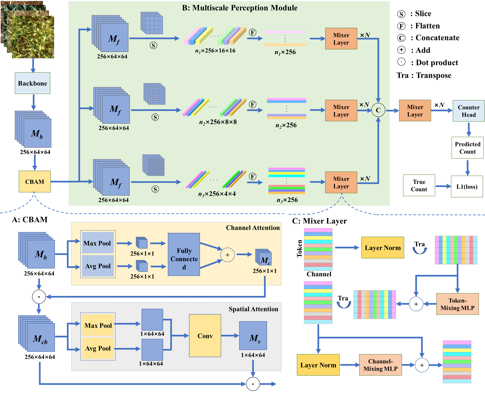
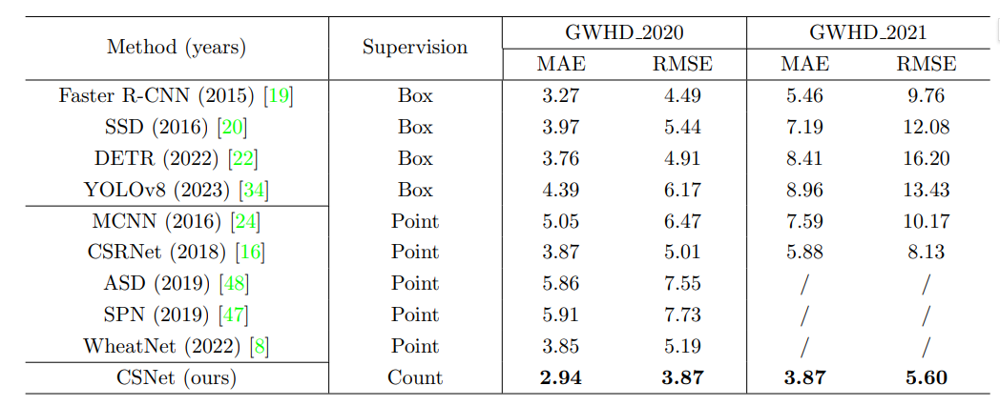

# CSNet

**Count-Supervised Network (CSNet)**  can complete the counting of wheat ears with only quantitative supervision.

paper: CSNet: A Count-supervised Network via Multiscale MLP-Mixer for Wheat Ear Counting

## The Overview of CSNet



## About Data
We use the global wheat Head Detection ([dataset](http://www.global-wheat.com/gwhd.html)) for training, where the quantity labels are obtained by summing the target boxes in the dataset.

## Training
```shell
python train.py --batch_size=16 --epoch=1000 --lr=1e-4 --device="cuda" 
```

## Mode Weight


## Result


